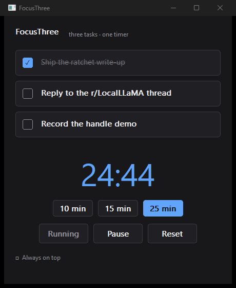
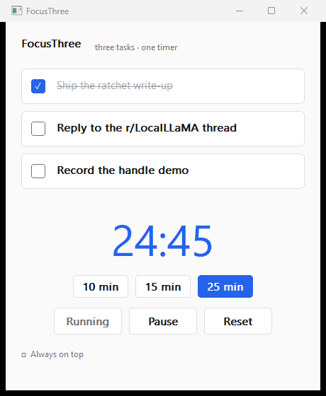

# FocusThree

**Three tasks. One timer. Nothing else.**

A focus tool that refuses to grow. Three task slots — not a list, three — and a
timer. No accounts, no sync, no notifications begging for attention, no backlog
quietly turning into its own source of anxiety. The cap *is* the feature.

| dark | light |
|---|---|
|  |  |

*Native Windows. The theme follows your system — title bar included — and nothing
was configured to make that happen.*

### ⬇ [Download FocusThree for Windows](https://github.com/datumstake/focus-three/releases/latest)

---

## What you actually download

One `.exe`, about **153 KB**. That is the entire product.

- **No installer.** Put it anywhere — Desktop, a USB stick, a synced folder. Run it.
- **No runtime.** No .NET, no Electron, no Visual C++ redistributable, no Java.
  It links nothing but Windows itself.
- **No background service**, no auto-start, no updater phoning home.
- **Uninstall** = delete the file. (And `%APPDATA%\FocusThree\` if you want your
  three tasks gone too.)

For scale: a typical Electron tray timer ships 150–250 MB to do this. This is
roughly **one thousandth** of that, and it opens instantly.

## What it does

- **Three task slots** with checkboxes. Checking one strikes it through and dims
  it. Text and checked-state survive a restart.
- **A focus timer** — 10 / 15 / 25-minute presets, Start / Pause / Reset, a large
  countdown, and three ascending tones when it reaches zero (synthesized by the
  OS; no audio file ships with the program).
- **Follows your system theme**, light or dark, and repaints the moment you switch
  Windows over. `--light` / `--dark` force one if you'd rather decide yourself.
- **Always on top**, optional, one click — so the timer stays visible over whatever
  you are actually working in.
- **Keyboard**: `Space` start/pause · `R` reset · `1` `2` `3` jump to a task ·
  `T` always-on-top.
- **Sharp at any DPI**, per-monitor aware — it stays crisp when you drag it to a
  different display.

## Privacy

It makes **zero network calls**. There is no telemetry, no crash reporter, no
account, no cloud. Your three tasks live in one text file at
`%APPDATA%\FocusThree\state.txt` — human-readable, yours, and never transmitted.
You can verify that claim with any firewall or with Resource Monitor: nothing
leaves.

## Try before you download

The [**browser demo**](https://datumstake.github.io/focus-three/) is the original
single-HTML-file version of the same idea. It runs offline too, and it is MIT
licensed — the `index.html` in this repo. The Windows application is a native
rewrite and is a separate, closed-source product.

## System requirements

Windows 10 or 11, 64-bit. No other requirements — that is the point.

## Source

The application's source is **not public**. This repository is its home for
screenshots, releases and documentation. The engineering write-up — why it is one
translation unit, why every control is custom-painted, and the startup data-loss
bug that silently wiped tasks until it was caught in a screenshot — is available
on request, as is the source itself under a commercial arrangement.

Open-source work lives in the sibling repos below; those are MIT and complete.

## Licence

The Windows application: proprietary, all rights reserved.
The browser demo (`index.html`): MIT — see [LICENSE](LICENSE).

---

Built by **[datumstake](https://github.com/datumstake)**. The rest of the set:

[pdftext](https://github.com/datumstake/pdftext) — PDF text extraction in one header file, no dependencies ·
[adapt-engine](https://github.com/datumstake/adapt-engine) — resolve a whole class of porting gaps from rules that carry their own proof ·
[self-verifying-ratchet](https://github.com/datumstake/self-verifying-ratchet) — automation that cannot grade its own work ·
[browser-pilot](https://github.com/datumstake/browser-pilot) — a real, logged-in Chrome through a handful of one-word verbs
