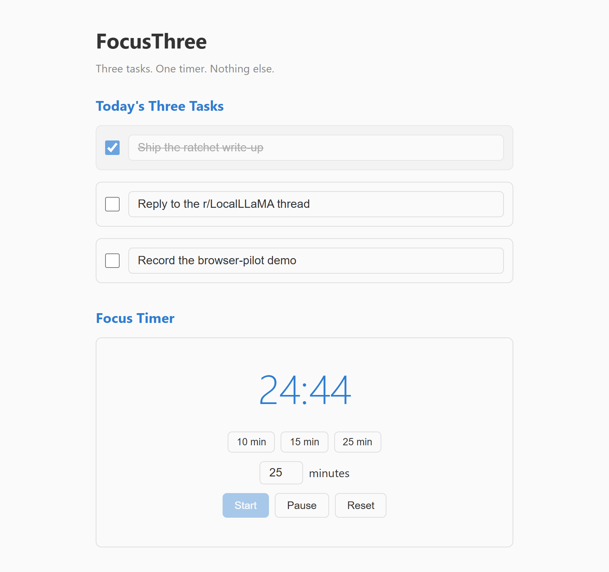
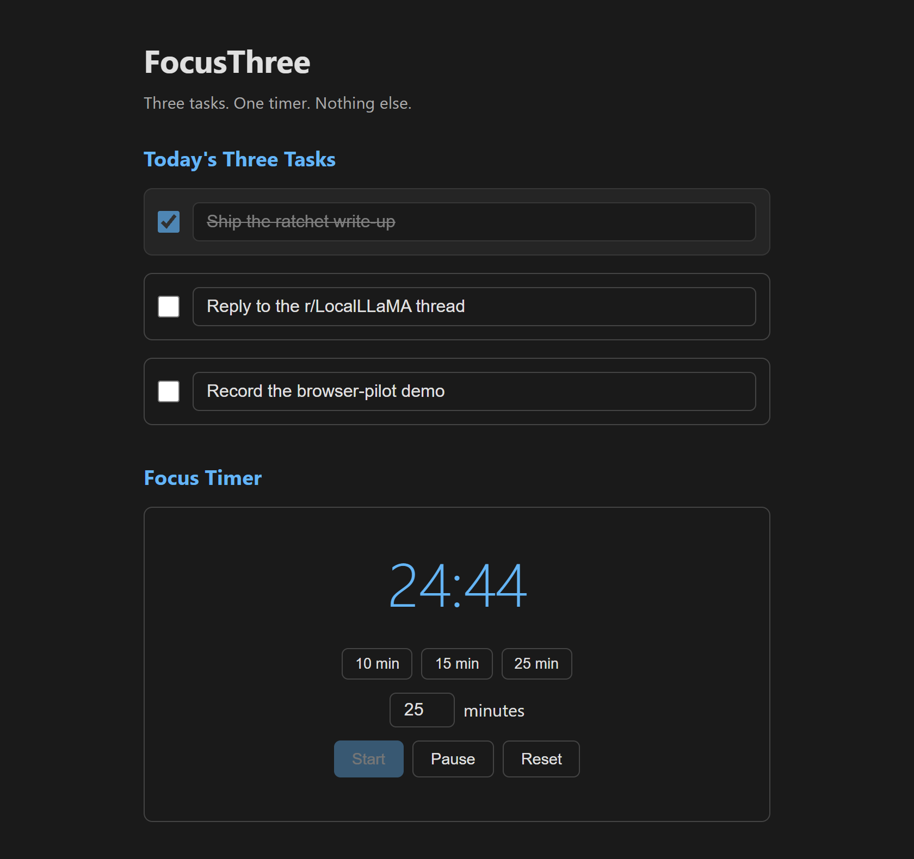

# FocusThree

[](https://datumstake.github.io/focus-three/)
[](index.html)
[](index.html)
[](index.html)
[](LICENSE)

A deliberately tiny focus tool: **three tasks, one timer, nothing else.** One
HTML file, no build step, no dependencies, no network, no tracking. Open it in a
browser — or host it anywhere static — and it works offline forever.

> Three tasks. One timer. Nothing else.

### ▶ [Try it live](https://datumstake.github.io/focus-three/)

The page you land on *is* the whole app. Save it to disk, pull the network cable,
and it still works — there is nothing to reach for.

| light | dark |
|---|---|
|  |  |

*Same file, same markup — the theme follows your system, nothing is configured.*

## Why so small

Most to-do apps fail by doing too much: infinite lists become their own source
of anxiety. FocusThree caps you at **three** tasks on purpose — the constraint
*is* the feature — and pairs them with a plain Pomodoro-style timer. It's built
for the "I just need to actually start" moment, not for project management.

## What it does

- **Three task slots** with checkboxes. Checking one strikes it through and dims
  the slot; your text and checked-state survive a reload.
- **A focus timer** with 10 / 15 / 25-minute presets and a custom minute entry.
  Start / Pause / Reset, a tabular-numeral countdown, and a soft tone (Web Audio,
  synthesized — no audio file) when it reaches zero.
- **Everything persists in `localStorage`.** No account, no server, no data ever
  leaves the page.
- **Respects your system theme** (light / dark via `prefers-color-scheme`).

## Use it

Open [the live page](https://datumstake.github.io/focus-three/), or open
`index.html` from a clone. That's the whole install.

```bash
# or serve it statically from anywhere:
python -m http.server 8000   # then visit http://localhost:8000
```

Single file, ~230 lines, vanilla HTML/CSS/JS. Fork it and change the task count,
the presets, the palette — it's all right there with no toolchain in the way.

## License

MIT. See [LICENSE](LICENSE).

---

Built by **[datumstake](https://github.com/datumstake)**. The rest of the set:

[gapsmith](https://github.com/datumstake/gapsmith) — resolve a whole class of porting gaps from rules that carry their own proof ·
[ratchet](https://github.com/datumstake/ratchet) — automation that cannot grade its own work ·
[handle](https://github.com/datumstake/handle) — a logged-in Chrome, nine verbs
